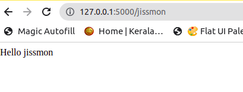

# Flask Tutorial

Class PLaylist: https://www.youtube.com/playlist?list=PLzMcBGfZo4-n4vJJybUVV3Un_NFS5EOgX


## Part 1 - How to make websites with python

Installation:

```bash
pip install flask
```

### Create Sample App

**app.py**

```py
from flask import Flask

# create flask app instance
app = Flask(__name__)


# define a home page and set a route to this page
@app.route('/')
def home():
    return 'Hello! this is the main page <h1>Hello</h1>'

# run the app
if __name__ == "__main__":
    app.run()
```

#### Run the App

Go to project folder,

```bash
python app.py
```

Open the browser and paste below 
URL to view home

http://127.0.0.1:5000

### Passing parameters from Routes

- Set name route and define a user.
- Whatever value passed in b/w the angle bracket will become a route. 
- That value then passed to name parameter and the page displays that name along with 'Hello'

```py
@app.route('/<name>')
def user(name):
    return f"Hello {name}"
```
Check Screenshot



### Redirect Feature

Redirect to a different page when navigating to a specific 
page.

- Import **redirect** and **url_for** methods.
- Redirect to home page when we move to */admin* page.

```py
from flask import Flask, redirect, url_for

@app.route('/admin')
def admin():
return redirect(url_for('home'))
```

### Redirect to new page which accepts a parameter as well.

- Here we redirect user page, user function takes a parameter name.
- Pass the parameter name in url_for() method.

```py
@app.route('/admin')
def admin():
    return redirect(url_for('user', name='Jissmon'))
```

## PART 2: HTML TEMPLATES

### render_template function

- **render_template** function allows us to grab a 
html file and render that as our web page.

**Steps:**

1. Create a templates directory
2. Create .html file.
3. Add template contents
4. Back in app.py file, call render_template().
5. Pass html file name as parameter to render_template().


**index.html**

```html

<!DOCTYPE html>
<html lang="en">
<head>
    <meta charset="UTF-8">
    <title>Home</title>
</head>
<body>
    <h1>Home Page</h1>
</body>
</html>
```

**app.py**

```py
@app.route('/')
def home():
    return render_template("index.html")
```

### Showing dynamic contents in front end 

- define variables with curly braces.
- pass those variables as parameters in render_template() function.

**index.html**

```html
<body>
    <h1>Home Page</h1>
    <p>Name: {{user_name}}</p>
    <p>Age: {{age}}</p>
</body>
```

**app.py**
```py
@app.route('/')
def home():
    name = 'jissmon'
    return render_template("index.html", user_name = name, age=25)
```

### Using forloop and if condition in template

```html
<body>
    
        {% if x % 2 == 1 %}
            <p>{{x}}</p>
        
    
</body>
```

### Looping through list in template

**app.py**

- Pass a list with contents

```py
@app.route('/')
def home():
    name = 'jissmon'
    return render_template("index.html", user_name = name,
                                         age=25,
                                         contents=['tim','joe', 'jerin'])
```

**index.html**

- Create a for loop to loop through the 
list of contents.

```html
<body>
    <h1>Home Page</h1>
    
        <p>{{x}}</p>
    
</body>
```

## Part 3: Adding Bootstrap and Template Inheritance

- Create a base.html file.

**base.html**

```html
<!DOCTYPE html>
<html lang="en">
<head>
    <meta charset="UTF-8">
    <title></title>
</head>
<body>
    
    
</body>
</html>
```

**index.html**

- In index.html file, we inherit the base.html file
and it's contents. We give the title and body from index.html. 

```html

Home Page

<h1>Test</h1>

```

- Set *debug=True* in app.py
- It allows user not to re-run the server everytime
we make the changes.

**app.py**
```py
if __name__ == "__main__":
    app.run(debug=True)
```

### Adding bootstrap

```html
<!DOCTYPE html>
<html lang="en">
<head>
    <meta charset="UTF-8">
    <link rel="stylesheet" href="https://cdn.jsdelivr.net/npm/bootstrap@4.3.1/dist/css/bootstrap.min.css" integrity="sha384-ggOyR0iXCbMQv3Xipma34MD+dH/1fQ784/j6cY/iJTQUOhcWr7x9JvoRxT2MZw1T" crossorigin="anonymous">
    <title></title>
</head>
<body>
    <h1>My Website</h1>
    
    

    <script src="https://code.jquery.com/jquery-3.3.1.slim.min.js" integrity="sha384-q8i/X+965DzO0rT7abK41JStQIAqVgRVzpbzo5smXKp4YfRvH+8abtTE1Pi6jizo" crossorigin="anonymous"></script>
    <script src="https://cdn.jsdelivr.net/npm/popper.js@1.14.7/dist/umd/popper.min.js" integrity="sha384-UO2eT0CpHqdSJQ6hJty5KVphtPhzWj9WO1clHTMGa3JDZwrnQq4sF86dIHNDz0W1" crossorigin="anonymous"></script>
    <script src="https://cdn.jsdelivr.net/npm/bootstrap@4.3.1/dist/js/bootstrap.min.js" integrity="sha384-JjSmVgyd0p3pXB1rRibZUAYoIIy6OrQ6VrjIEaFf/nJGzIxFDsf4x0xIM+B07jRM" crossorigin="anonymous"></script>
</body>
</html>
```

## Part 4: HTTP Methods


### Determine Whether user called a POST or GET request

time: 6:30